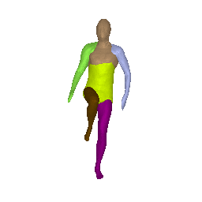
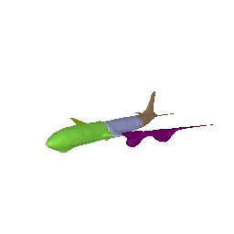
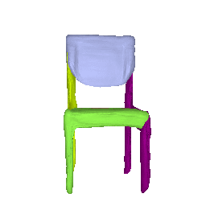
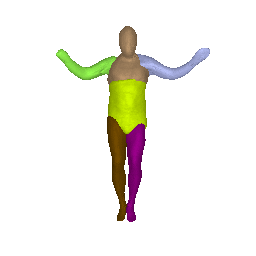
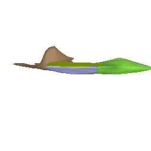

## Neural Parts: Learning Expressive 3D Shape Abstractions with Invertible Neural Networks
<p>
    
    
    
</p>

This repository contains the code that accompanies our CVPR 2021 paper
[Neural Parts: Learning Expressive 3D Shape Abstractions with Invertible Neural Networks](https://paschalidoud.github.io/neural_parts)

You can find detailed usage instructions for training your own models and using our pretrained models below.

If you found this work influential or helpful for your research, please consider citing

```
@Inproceedings{Paschalidou2021CVPR,
     title = {Neural Parts: Learning Expressive 3D Shape Abstractions with Invertible Neural Networks},
     author = {Paschalidou, Despoina and Katharopoulos, Angelos and Geiger, Andreas and Fidler, Sanja},
     booktitle = {Proceedings IEEE Conf. on Computer Vision and Pattern Recognition (CVPR)},
     year = {2021}
}
```

## Installation & Dependencies

Our codebase has the following dependencies:

- [numpy](https://numpy.org/doc/stable/user/install.html)
- [cython](https://cython.readthedocs.io/en/latest/src/quickstart/build.html)
- [pillow](https://pillow.readthedocs.io/en/stable/installation.html)
- [pyyaml](https://pyyaml.org/wiki/PyYAMLDocumentation)
- [torch && torchvision](https://pytorch.org/get-started/locally/)
- [trimesh](https://github.com/mikedh/trimesh)
- [tqdm](https://github.com/tqdm/tqdm)

For the visualizations, we use [simple-3dviz](http://simple-3dviz.com), which
is our easy-to-use library for visualizing 3D data using Python and ModernGL and
[matplotlib](https://matplotlib.org/) for the colormaps. Note that
[simple-3dviz](http://simple-3dviz.com) provides a lightweight and easy-to-use
scene viewer using [wxpython](https://www.wxpython.org/). If you wish you use
our scripts for visualizing the reconstructed primitives, you will need to also
install [wxpython](https://anaconda.org/anaconda/wxpython).

The simplest way to make sure that you have all dependencies in place is to use
[conda](https://docs.conda.io/projects/conda/en/4.6.1/index.html). You can
create a conda environment called ```neural_parts``` using
```
conda env create -f environment.yaml
conda activate neural_parts
```

Next compile the extenstion modules. You can do this via
```
python setup.py build_ext --inplace
pip install -e .
```

## Demo




You can now test our code on various inputs. To this end, simply download some
input samples together with our pretrained models on D-FAUAST humans, ShapeNet chairs and ShapeNet planes
from
[here](https://drive.google.com/drive/folders/11U0q441kOXJL1tx2WLott4XNJ0m7HCLs?usp=sharing).
Now extract the ``nerual_parts_demo.zip`` that you just downloaded in the demo
folder. To run our demo on the D-FAUST humans simply run
```
python demo.py ../config/dfaust_6.yaml --we ../demo/model_dfaust_6 --model_tag 50027_jumping_jacks:00135 --camera_target='-0.030173788,-0.10342446,-0.0021887198' --camera_position='0.076685235,-0.14528269,1.2060229' --up='0,1,0' --with_rotating_camera
```
This script should create a folder ``demo/output``, where the per-primitive
meshes are stored as ``.obj`` files. Similarly, you can now also run the demo for the input airplane
```
python demo.py ../config/shapenet_5.yaml --we ../demo/model_planes_5 --model_tag 02691156:7b134f6573e7270fb0a79e28606cb167 --camera_target='-0.030173788,-0.10342446,-0.0021887198' --camera_position='0.076685235,-0.14528269,1.2060229' --up='0,1,0' --with_rotating_camera
```

## Usage

As soon as you have installed all dependencies and have obtained the
preprocessed data, you can now start training new models from scratch, evaluate
our pre-trained models and visualize the recovered primitives using one of our
pre-trained models.

### Reconstruction
To generate meshes using a trained model, we provide the
``forward_pass.py`` and the ``visualize_predictions.py`` scripts. Their
difference is that the first performs the forward pass and generates a
per-primitive mesh that is saved as an ``.obj`` file. Similarly, the
``visualize_predictions.py`` script performs the forward pass and visualizes
the predicted primitives using [simple-3dviz](https://simple-3dviz.com/). The
``forward_pass.py`` script is ideal for reconstructing inputs on a heeadless
server and you can run it by executing
```
python forward_pass.py path_to_config_yaml path_to_output_dir --weight_file path_to_weight_file --model_tag MODEL_TAG
```
where the argument ``--weight_file`` specifies the path to a trained model and
the argument ``--model_tag`` defines the model_tag of the input to be
reconstructed.

To run the ``visualize_predictions.py`` script you need to run
```
python visualize_predictions.py path_to_config_yaml path_to_output_dir --weight_file path_to_weight_file --model_tag MODEL_TAG
```
Using this script, you can easily render the prediction into ``.png`` images or
a ``.gif``, as well as perform various animations by rotating the camera.
Furthermore, you can also specify the camera position, the up vector and the
camera target as well as visualize the target mesh together with the predicted
primitives simply by adding the ``--mesh`` argument.

### Evaluation
For evaluation of the models we provide the script ``evaluate.py``. You can run it using:
```
python evaluate.py path_to_config_yaml path_to_output_dir
```
The script reconstructs the input and evaluates the generated meshes using a
standardized protocol. For each input, the script generates a ``.npz`` file
that contains the various metrics for that particular input. Note that this
script can also be executed multiple times in order to speed up the evaluation
process. For example, if you wish to run the evaluation on 6 nodes, you can
simply run

```
for i in {1..6}; do python evaluate.py path_to_config_yaml path_to_output_dir & done
[1] 9489
[2] 9490
[3] 9491
[4] 9492
[5] 9493
[6] 9494

wait
Running code on cpu
Running code on cpu
Running code on cpu
Running code on cpu
Running code on cpu
Running code on cpu
```
Again the script generates a per-input file in the output directory with the
computed metrics.

### Training
Finally, to train a new network from scratch, we provide the
``train_network.py`` script. To execute this script, you need to specify the
path to the configuration file you wish to use and the path to the output
directory, where the trained models and the training statistics will be saved.
Namely, to train a new model from scratch, you simply need to run
```
python train_network.py path_to_config_yaml path_to_output_dir
```
Note tha it is also possible to start from a previously trained model by
specifying the ``--weight_file`` argument, which should contain the path to a
previously trained model. Furthermore, by using the arguments `--model_tag` and
``--category_tag``, you can also train your network on a particular model (e.g.
a specific plane, car, human etc.) or a specific object category (e.g. planes,
chairs etc.)

Note that, if you want to use the RAdam optimizer during training, you will have
to also install to download and install the corresponding code from [this
repository](https://github.com/LiyuanLucasLiu/RAdam).

## License
Our code is released under the MIT license which practically allows anyone to do anything with it.
MIT license found in the LICENSE file.

## Relevant Research
Below we list some papers that are relevant to our work.

**Ours:**
- Learning Unsupervised Hierarchical Part Decomposition of 3D Objects from a Single RGB Image [pdf](https://paschalidoud.github.io/),[project-page](https://superquadrics.com/hierarchical-primitives.html)
- Superquadrics Revisited: Learning 3D Shape Parsing beyond Cuboids [pdf](https://arxiv.org/pdf/1904.09970.pdf),[project-page](https://superquadrics.com/learnable-superquadrics.html)

**By Others:**
- Learning Shape Abstractions by Assembling Volumetric Primitives [pdf](https://arxiv.org/pdf/1612.00404.pdf)
- 3D-PRNN: Generating Shape Primitives with Recurrent Neural Networks [pdf](https://arxiv.org/abs/1708.01648.pdf)
- Im2Struct: Recovering 3D Shape Structure From a Single RGB Image [pdf](http://openaccess.thecvf.com/content_cvpr_2018/html/Niu_Im2Struct_Recovering_3D_CVPR_2018_paper.pdf)
- Learning shape templates with structured implicit functions [pdf](https://arxiv.org/abs/1904.06447)
- CvxNet: Learnable Convex Decomposition [pdf](https://arxiv.org/abs/1909.05736)
